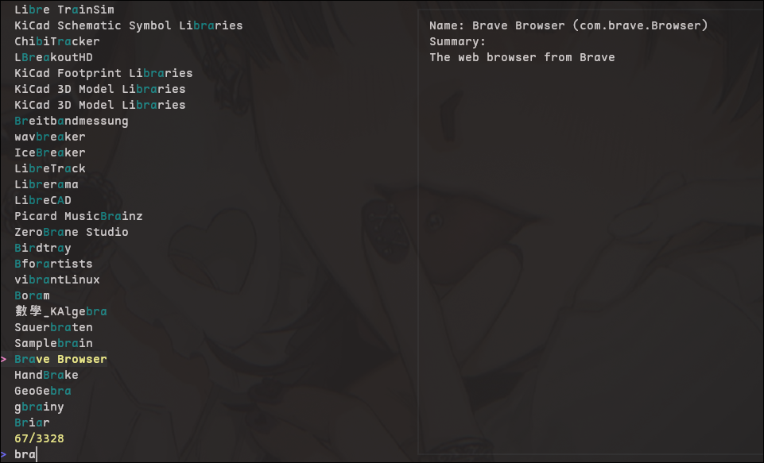

## Go Flatpak CLI

A simple command line tool to search and install flatpaks.
Using "flatpak search org.XYZ.123" is not only inconvenient, its woefully slow.
With go-flatpak you can just run it and install what you wan't too!

<i>Please note that go-flatpak is still in an early phase!</i>
