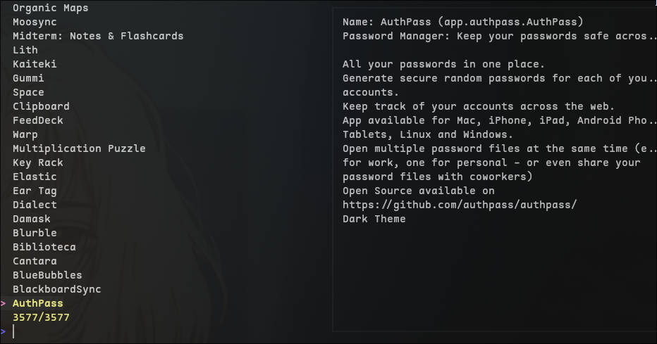

A simple command line tool to search and install flatpaks.
Using "flatpak search org.XYZ.123" is not only inconvenient, its annoying and slow.
With go-flatpak you can just run it and install what you wan't too without using the slow CLI tool
or having to use a GUI flatpak installer.

Its the same issue with running flatpaks on the command line. The names are hard to remember and ridiculous
to type... `go-flatpak` solves this issue by creating "shim" scripts that wrap running the flatpak, so now
you can just type `blender` insead of `flatpak run org.Blender.blender` and its easier to maintain than creating
shims manually or adding each one as an alias.



<i>Please note that go-flatpak is still in an early phase!</i>

Build and run:
```sh
  go build -o go-flatpak
  ./go-flatpap
```

Use the Fzf-like interface to browse through the flatpak database and hit ENTER to install a package
or mark multiple packages with TAB to install more than one at a time.

> if this project becomes more popular, I will add binaries for Unix platforms in the releases section.

# Export flatpak apps to the Command line
## Link Flatpak apps to their usual command line names

```sh
  ./go-flatpak --link
```

Creates a "flatpak-bin" folder in the current directory with executable files that link the flatpak app
with their shorthand names that you would usually use on the command line for a non-flatpak tool or application.

Examples:
- `org.Blender.blender` becomes `blender`
- `io.github.giantpinkrobots.flatsweep` becomes `flatsweep`
- `com.google.AndroidStudio` becomes `android_studio`
